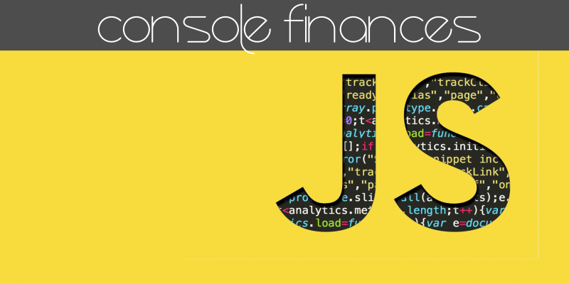

<!-- Readme top-->

<!-- Project shields -->

<!-- centered shields -->

  [![Stargazers][stars-shield]][stars-url]
  [![Issues][issues-shield]][issues-url]
  [![MIT License][license-shield]][license-url]
  [![LinkedIn][linkedin-shield]][linkedin-url]

<!-- Readme Header -->

  

<!-- PROJECT LOGO -->
 

  

<h2 align="center">Console-Finances assignment: written in vanilla JavaScript</h2>

  

    Multi-dimensional arrays, iteration, .length, .push, .toFixed() and interpolated output.
     
    <a href="https://github.com/Matt-Jones-Developer/Console-Finances/"><strong>Explore the docs »</strong></a>
     
     
    <a href="https://matt-jones-developer.github.io/Console-Finances/">View Project</a>
    ·
    <a href="https://github.com/Matt-Jones-Developer/Console-Finances/issues">Report Bug</a>
    ·
    <a href="https://github.com/Matt-Jones-Developer/Console-Finances/issues">Request Feature</a>
  

<!-- TABLE OF CONTENTS -->

  
Table of Contents

  <ol>
    <li>
      <a href="#about-the-project">About The Project</a>
      <ul>
        <li><a href="#built-with">Built With</a></li>
      </ul>
    </li>
    <li>
      <a href="#getting-started">Getting Started</a>
      <ul>
        <li><a href="#prerequisites">Prerequisites</a></li>
        <li><a href="#installation">Installation</a></li>
      </ul>
    </li>
    <li><a href="#usage">Usage</a></li>
    <li><a href="#roadmap">Roadmap</a></li>
    <li><a href="#contributing">Contributing</a></li>
    <li><a href="#license">License</a></li>
    <li><a href="#contact">Contact</a></li>
    <li><a href="#acknowledgments">Acknowledgments</a></li>
  </ol>

<!-- ABOUT THE PROJECT -->
## About The Project

[![product-screenshot]](https://github.com/Matt-Jones-Developer/Console-Finances)

I was asked to write a program that could generate a financial report within the console, using vanilla JS.

The output demonstrates that my code met the following criteria:

- [ ] Find the total number of months [DONE]
- [ ] Find the total income for the entire period [DONE]
- [ ] Find the 'average change' (2 parts) [DONE]
    - [ ] Calculate the PnL for each month [DONE]
    - [ ] Find the average change in $ [DONE]
- [ ] Calculate and display the month with the biggest increase in profits [DONE]
- [ ] Calculate and display the month with the biggest loss in profits [DONE]

I found the project (initially) both challenging and confusing, since we were given an alternative set of answers that I thought were the 'correct' ones; in the end my answers matched the ones from the original project brief.  I felt like I had to teach myself JavaScript before I could even write any code.  A lot of what was required was not previously taught, but I get why that was an advantage to improve my problem solving skills and my Google searching skills to seek out and test new syntax and ideas for myself - which really bumped up my game and made me feel pretty confident.

As a complete beginner to JS, I utilized Google a lot, experimented with new ideas and syntax (I must have a draft with over 1000 lines of code, trying to work out how to solve each issue!) - most times I was over-thinking and over complicating them, but I was proud to solve the problems finally, with some cleanly written, fairly concise Javascript!

(<a href="#readme-top">back to top</a>)

### Built With

* [![JavaScript]][javascript-url]

(<a href="#readme-top">back to top</a>)

<!-- GETTING STARTED -->
## Getting Started

This very simple console application can be accessed by entering the console within your browser!
Please open main.js within the scripts folder to view my vanilla JS code.

### Prerequisites

N/A

### Installation

N/A

<!-- USAGE EXAMPLES -->
## Usage

Screenshot of the programs output:

[![Product Name Screen Shot][console-output-screenshot]](https://matt-jones-developer.github.io/Console-Finances/)

(<a href="#readme-top">back to top</a>)

<!-- ROADMAP -->
## Roadmap

N/A

(<a href="#readme-top">back to top</a>)

<!-- CONTRIBUTING -->
## Contributing

N/A

<!-- LICENSE -->
## License

Distributed under the MIT License. See `LICENSE.txt` for more information.

(<a href="#readme-top">back to top</a>)

<!-- CONTACT -->
## Contact

Your Name - [@twitter_handle](https://twitter.com/glitchy81_dev)

Project Link: [https://github.com/Matt-Jones-Developer/Console-Finances](https://github.com/Matt-Jones-Developer/Console-Finances)

(<a href="#readme-top">back to top</a>)

<!-- ACKNOWLEDGMENTS -->
## Acknowledgments

* [Original Creator of this README Template](https://github.com/othneildrew/Best-README-Template)
* [Co-worker for Task 3 Ana](https://github.com/Matt-Jones-Developer/Console-Finances)
* [Co-worker for Task 3 Connie](https://github.com/Matt-Jones-Developer/Console-Finances)

(<a href="#readme-top">back to top</a>)

<!-- MARKDOWN LINKS & IMAGES -->
<!-- https://www.markdownguide.org/basic-syntax/#reference-style-links -->
[contributors-shield]: https://img.shields.io/github/contributors/matt-jones-developer/Console-Finances.svg?style=for-the-badge
[contributors-url]: https://github.com/matt-jones-developer/Console-Finances/graphs/contributors
[forks-shield]: https://img.shields.io/github/forks/matt-jones-developer/Console-Finances.svg?style=for-the-badge
[forks-url]: https://github.com/Matt-Jones-Developer/Console-Finances/network/members
[stars-shield]: https://img.shields.io/github/stars/matt-jones-developer/Console-Finances.svg?style=for-the-badge
[stars-url]: https://matt-jones-developer.github.io/Console-Finances/stargazer
[issues-shield]: https://img.shields.io/github/issues/matt-jones-developer/Console-Finances.svg?style=for-the-badge
[issues-url]: https://github.com/Matt-Jones-Developer/Console-Finances/issues
[license-shield]: https://img.shields.io/github/license/matt-jones-developer/Console-Finances.svg?style=for-the-badge
[license-url]: https://github.com/Matt-Jones-Developer/Console-Finances/blob/main/LICENSE.txt
[linkedin-shield]: https://img.shields.io/badge/-LinkedIn-black.svg?style=for-the-badge&logo=linkedin&colorB=555
[linkedin-url]: www.linkedin.com/in/matt-jones-zx81
[product-screenshot]: images/screenshot.png
[console-output-screenshot]: images/console_output_screenshot.png
[javascript-url]: https://www.javascript.com

